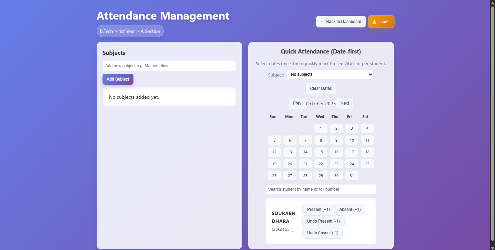
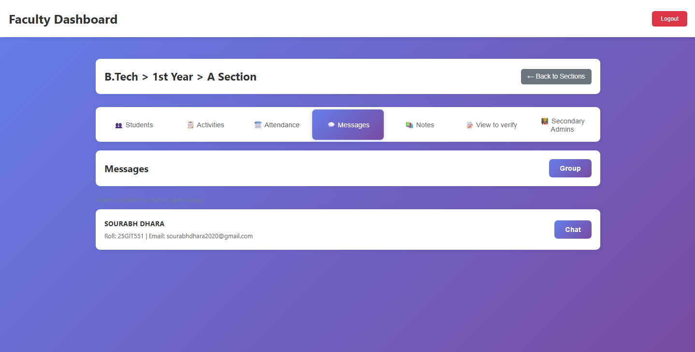
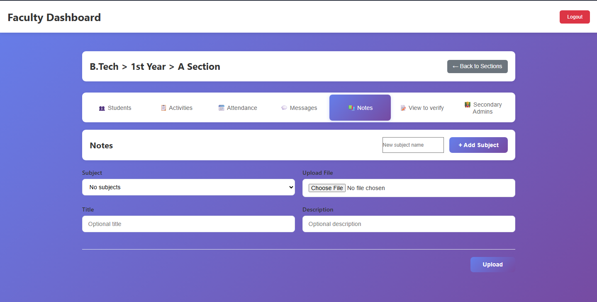

<div align="center">

# 🎓 Student Track Recorder

<a href="https://sourabhdhara.pythonanywhere.com/" target="_blank">
  
</a>
<br><br>


**A comprehensive, interactive, and user-friendly Web Application to manage educational institutions seamlessly.**

[](https://www.python.org/)
[](https://flask.palletsprojects.com/)
[](https://opensource.org/licenses/MIT)
[](#)

[**Explore Features**](#-core-features-detailed) •
[**Installation**](#-quick-start) •
[**Screenshots**](#-interactive-gallery) •
[**Contributing**](#-how-to-contribute)

</div>

---

## 🌟 About The Project

**Student Track Recorder** is an all-in-one portal designed to bridge the gap between Faculty, Secondary Administrators (Teachers/Assistants), and Students. Built with **Flask** and structured with simple JSON storage, it eliminates database overhead while providing robust features like attendance tracking, file sharing, direct messaging, and document scrutiny.

### 🔑 Key Highlights:
- 🚀 **Zero Database Overhead:** Operates blazingly fast using secure JSON data structures.
- 🏢 **Three-Tier Architecture:** Distinct portals with customized privileges for Main Faculty, Secondary Admins, and Students.
- 🎨 **Interactive UI:** Clean, responsive, and intuitive design tailored for everyday academic use.

---

## 🚀 Quick Start

Get the project running on your local machine in just a few steps.

### Prerequisites
Make sure you have [Python 3.7+](https://www.python.org/downloads/) installed.

### Installation

```bash
# 1. Clone the repository
git clone https://github.com/your-username/student-track-recorder.git
cd student-track-recorder/student-track-recorder

# 2. Install dependencies (Flask & Werkzeug)
pip install -r requirements.txt

# 3. Run the application
python app.py
```
> 🌐 **Visit** `http://localhost:5000` **in your browser to see the app live!**

---

## 🎯 User Roles & Portals

<details open>
<summary><b>👨‍🏫 Main Faculty (Admin)</b></summary>
<br>
The highest level of access. Manages the entire academic hierarchy and oversees all operations.

- **Default Credentials:** `faculty` / `1`
- **Capabilities:**
  - Create and manage Courses, Academic Years, and Sections.
  - Onboard Students with detailed profiles and photos.
  - Assign and manage Secondary Administrators (Teachers).
  - Overall monitoring of attendance, certificates, and submissions.

*Dashboard Preview:*
<br>

</details>

<details>
<summary><b>👩‍🏫 Secondary Admin (Teacher)</b></summary>
<br>
Assigned to specific sections by the Main Faculty. Focuses on day-to-day academic tracking.

- **Default Credentials:** `secondary` / `1`
- **Capabilities:**
  - Mark daily and subject-wise attendance.
  - Upload study materials and notes.
  - Review and verify student document submissions.
  - Participate in private or group messaging with students.

*Dashboard Preview:*
<br>

</details>

<details>
<summary><b>🎓 Student</b></summary>
<br>
The end-users who consume content, track their progress, and interact with faculty.

- **Capabilities:**
  - Track real-time attendance and report discrepancies directly.
  - Access uploaded certificates, notes, and study resources.
  - Submit documents for administrative scrutiny.
  - Chat with peers or teachers securely from the portal.

*Dashboard Preview:*
<br>

</details>

---

## 📸 Interactive Gallery

Explore the visually rich interfaces designed for maximum productivity and ease of use.

| Login Interface | Course Selection |
| :---: | :---: |
|  |  |
| **Secure Authentication** | **Organized Academic Structure** |

| Attendance Management | Communications |
| :---: | :---: |
|  |  |
| **Subject-wise Tracking** | **Real-time Chat & Groups** |

| Document Scrutiny | Resource Sharing |
| :---: | :---: |
|  |  |
| **Verification Portal** | **Organized Notes & Materials** |

---

## ✨ Core Features Detailed

### 🛡️ Multi-Role Security & Hierarchy
A strict access control system ensures that users only see what they are supposed to. Admins control the global state, teachers manage their designated subjects, and students track their individual performance. 

### 📊 Comprehensive Tracking
- **Attendance:** Granular tracking by subject and date. Includes a built-in *issue reporting system* for students to contest marks or ask for corrections.
- **Activities & Progress:** Teachers can assign tasks, monitor student participation, and leave constructive remarks on student progress.

### 📁 Unified File Management
- **Certificates:** Secure storage for official achievements and awards.
- **Notes:** Subject-categorized study material repositories for quick access before exams.
- **Document Scrutiny:** A dedicated pipeline for students to submit documents and track verification status from pending to approved.

### 💬 Integrated Communication
- **Group Channels:** Section-wide discussions for class announcements and group problem-solving.
- **Direct Messaging:** Private 1-on-1 chats with file attachment support between students and faculty.
- **Permissions:** Admins can customize chat access levels dynamically to maintain decorum.

---

## 📁 Project Architecture

> The project is designed with simplicity in mind, utilizing Python's robust standard library alongside Flask.

```text
student-track-recorder/
├── app.py                 # Core routing & Flask application
├── requirements.txt       # Dependencies
├── templates/             # HTML templates (Jinja2)
│   ├── index.html
│   └── attendance.html
├── static/                # Static assets (CSS, JS)
│   ├── style.css
│   └── script.js
└── data/                  # JSON Data Storage Hierarchy
    ├── main_credential.json
    └── B.Tech/
        └── 1st Year/
            └── A Section/
                ├── students.json
                ├── attendance.json
                ├── messages.json
                └── ...
```

---

## 🤝 How to Contribute

We are always open to enhancements and bug fixes! Follow these steps to contribute:

1. **Fork** the repository.
2. **Clone** your fork locally.
3. **Create a new branch:** `git checkout -b feature/awesome-feature`
4. **Commit your changes:** `git commit -m "Add awesome feature"`
5. **Push to the branch:** `git push origin feature/awesome-feature`
6. Open a **Pull Request** and describe your changes!

---

<div align="center">
  <b>Built with ❤️ for Educational Institutions</b><br>
  <i>Empowering teachers and students with seamless digital management.</i>
</div>
